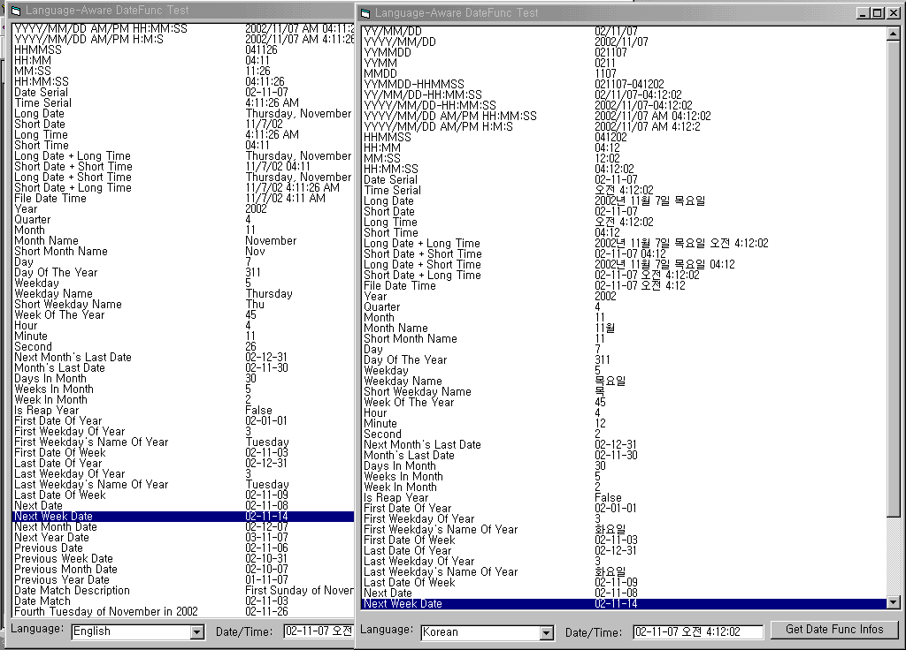



## DateFunc \(Language\-Aware Date Functions\)

### Description

Date functions with which you can specify any language. Full of useful date functions and enumerations. See screenshot. Please vote and leave comments, if you like.
 
### More Info
 

             |
---                |---
**Submitted On**   |2002-11-06 14:22:04
**By**             |[S\.Y\. Kim](https://github.com/Planet-Source-Code/PSCIndex/blob/master/ByAuthor/s-y-kim.md)
**Level**          |Intermediate
**User Rating**    |4.8 (19 globes from 4 users)
**Compatibility**  |VB 6\.0, VBA MS Access, VBA MS Excel
**Category**       |[Math/ Dates](https://github.com/Planet-Source-Code/PSCIndex/blob/master/ByCategory/math-dates__1-37.md)
**World**          |[Visual Basic](https://github.com/Planet-Source-Code/PSCIndex/blob/master/ByWorld/visual-basic.md)
**Archive File**   |[DateFunc\_\(1492891162002\.zip](https://github.com/Planet-Source-Code/s-y-kim-datefunc-language-aware-date-functions__1-40464/archive/master.zip)

